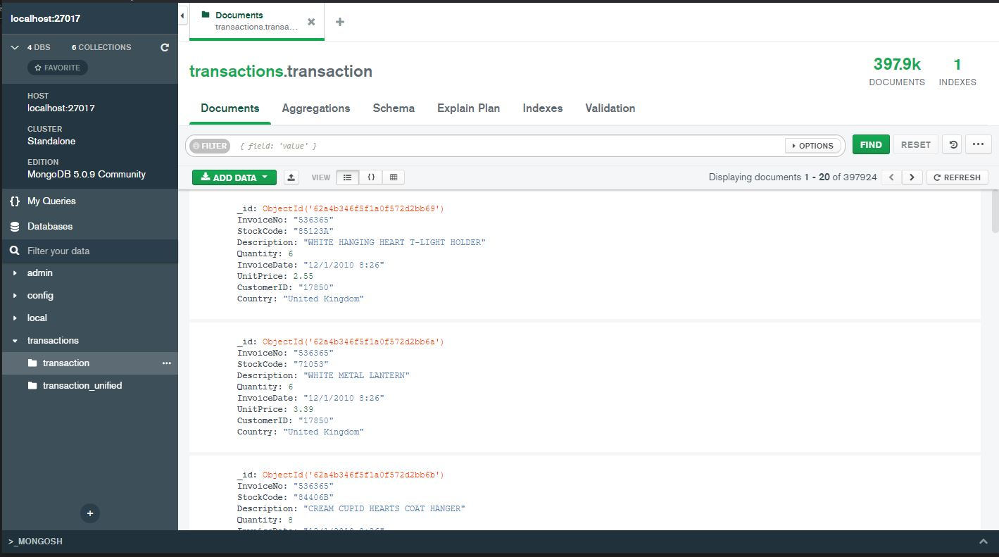
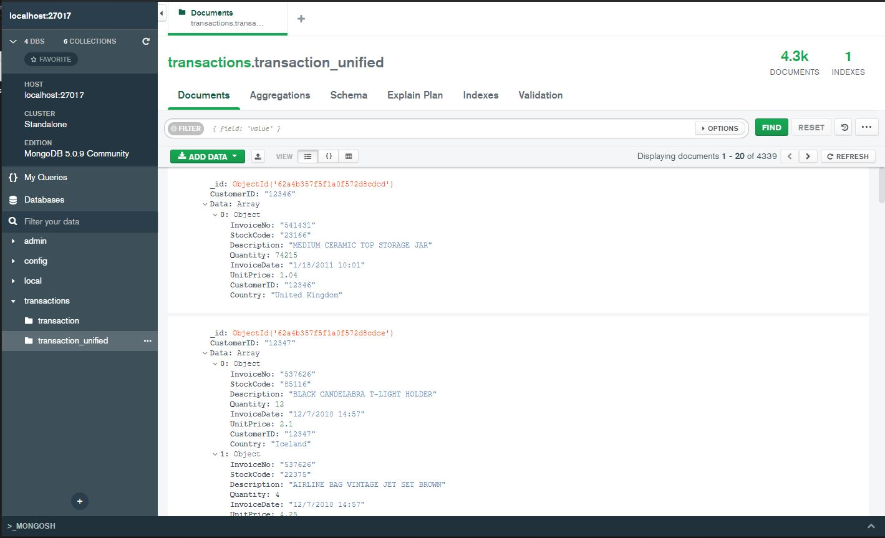

# pyDBs (not the best practices but it works)
Insert and select statments in Python by using pandas.


<p style="text-align:center">
 


</p>
<br>

### PostgreSQL
Create PostgreSQL engine using Docker:
```bash
docker pull postgres
docker run --name docker_postgres -e POSTGRES_PASSWORD=123456 -d -p 5432:5432 postgres
```
[PostgreSQL Notebook](postgresql/postgres.ipynb)


### MongoDB
Create MongoDB using Docker:
```bash
docker pull mongodb
docker run --name docker_mongo -e MONGO_INITDB_ROOT_PASSWORD=123456 -e MONGO_INITDB_ROOT_USERNAME=mongo_user -d -p 27017:27017 mongo
```
[MongoDB Notebook](mongodb/mongodb.ipynb)


### Redis
Create Redis using Docker:
```bash
docker pull redis
docker run -d --name redis-stack-server -p 6379:6379 redis
```
[Redis Notebook](redis/redis.ipynb)

### ElasticSearch
Create ElasticSearch Single Node using docker-compose:
```bash
cd elasticsearch
docker-compose up -d
```
[ElasticSearch Notebook](elasticsearch/elasticsearch.ipynb)

<br>

### Screenshots
<p align="center">
   <br>
   
</p>

